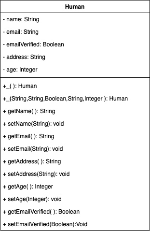

# Step 01 Back to the Basics

## Procedural Programming

### What is procedural programming?
* Procedural (structured) programming consists of designing a set of procedures (algorithms) to solve a problem.
* The procedural paradigm suggests that a programmer will:
	* firstly, identify *which algorithms* to manipulate data
	* secondly, identify *which structures* use which algorithms.

### Why do we use procedural programming?
* **Small** problems are easily resolved with a procedural implementation

### Why do we not use procedural programming?
* Procedural implementations scale poorly.
* As the program grows in size, its complexity increases.
	* behaviors become tightly-coupled
	* debugging becomes more difficult
	* code-changes and maintenance becomes more difficult
	* testing a single aspect becomes nearly impossible

## OOP

### Object-Oriented Programming

OOP stands for Object-Oriented Programming. Procedural programming is about writing procedures or functions that perform operations on the data, while object-oriented programming is about creating objects that contain both data and functions.


### Why do we use OOP?
* **Large** problems can more be more easily scaled using the OOP paradigm.
* OOP allows users to break problem down into small logical objects
* OOP allows users to view code-details within the context of a specific object
* OOP allows users to more easily debug code
* OOP allows greater testability of code


### Object Oriented Programming (OOP)
* An object-oriented program is made of objects
* Each object has specific functionalities, which users access via the object's **methods**.
* The OOP paradigm suggests that a programmer will
	* firstly identify *which structures* to manipulate data
	* secondly identify *what algorithms* each structure will use

### The 3 aspects of an object
* **Identity** - **What is its location?**
	* How is that object distinguished from other objects of the same type?
* **State** - **What does it store?**
	* What is the value of the internal objects this object contains?
* **Behavior** - **How does it act?**
	* What services or actions this object can perform?

## In Java

### Classes
* A **class** is a template, or blueprint from which objects are made
	* it is the cookie-cutter to a cookie
	* it is the _classification_ of an object.

### Class naming conventions
* Class names must begin with a letter followed by any combination of letters, digits, and underscores.
  * By convention, class names start with a capital letter.
	* You cannot use a Java _reserved word_ to name a variable or class.
* Whitespace is irrelevant to the Java compiler

### Encapulsation
* Classes *encapsulate* several **data-fields** and behaviors into a single entity.
* **Encapsulation** is combining class-members (methods and variables) in a single scope.

### Instance-Fields

* An instance-field, or instance-variable are representative of the _properties_ or _attributes_ of a `Class`.
* By aggregating the values of an instance's fields, we derive the instance's _state_.

## Encapsulation in Java
"Wraps" several data fields into a single entity

```java
// class signature
public class Person {
	// instance variables (fields)
	private String name;
	private Integer age;
	private Boolean isFemale;

	// constructor
	public Person(String name, Integer age, Boolean isFemale) {
		this.name = name;
		this.age = age;
		this.isFemale = isFemale;
	}
}
```

### Instance-Methods
* behaviors of an object are made available to users via the object's **methods**
* methods which are invoked on an **object** are **instance-methods**
* method-names should describe the intended behavior of the object
* methods of an object have hidden implementation
* methods describe a "can perform" relationship.

### Instance-Variables (Fields)
* field-values of an object are made available to users via the object's **getters**
* variable-values of an object can be manipulated by the user via the object's **setters**
* the aggregation of an object's variable's values determines the object's **state**.
* fields describe a "has a" relationship.

## In JavaScript

### Create JavaScript Object with Object Literal

One of easiest way to create a javascript object is object literal, simply define the property and values inside curly braces as shown below

```
let bike = {name: 'SuperSport', maker:'Ducati', engine:'937cc'};
```

### Property accessors

Properties of a javascript object can be accessed by dot notation or bracket notation as shown below

```
let bike = {name: 'SuperSport', maker:'Ducati', engine:'937cc'};
console.log(bike.engine);     //Output: '937cc'
console.log(bike['maker']);   //Output: 'Ducati'
```

### Adding property to the object

To add property to the already created object, no need to change the existing object literal, property can be added later with dot notation as shown below

```
let bike = {name: 'SuperSport', maker:'Ducati', engine:'937cc'};
bike.wheelType = 'Alloy';
console.log(bike.wheelType);   //Output: Alloy
```

### Object methods

Behavior can be added to the object as well, behaviors are nothing but functions or methods. Methods can be part of object while creation or can be added later like properties as shown below

```
let bike = {
   name: 'SuperSport', 
   maker:'Ducati', 
   start: function() {
       console.log('Starting the engine...');
   }
};
bike.start();   //Output: Starting the engine...
/* Adding method stop() later to the object */
bike.stop = function() {
    console.log('Applying Brake...');  
}
bike.stop();    //Output: Applying Brake...
```

### Create JavaScript Object with Constructor
Constructor is nothing but a function and with help of new keyword, constructor function allows to create multiple objects of same flavor as shown below

```
function Vehicle(name, maker) {
   this.name = name;
   this.maker = maker;
}
let car1 = new Vehicle(’Fiesta’, 'Ford’);
let car2 = new Vehicle(’Santa Fe’, 'Hyundai’)
console.log(car1.name);    //Output: Fiesta
console.log(car2.name);    //Output: Santa Fe
```

**this and new keyword**

* Every function, while executing has a reference to its current execution context called this (keyword).
* The new keyword in front of any function turns the function call into constructor call

### Create JavaScript Object with create method

Object.create() allowed to create object with more atrribute options like configurable, enumerable, writable and value as shown below

```
let car = Object.create(Object.prototype,
  {
    name:{
      value: 'Fiesta',
      configurable: true,
      writable: true,
      enumerable: false
    },
    maker:{
      value: 'Ford',
      configurable: true,
      writable: true,
      enumerable: true
    }
  });
console.log(car.name)    //Output: Fiesta
```

### Prototype
* Every single object is built by constructor function.
* A constructor function makes an object linked to its own prototype.
* Prototype is an arbitrary linkage between the constructor function and object.

### Create JavaScript Object using ES6 classes

ECMAScript 6 (newer version of javascript) supports class concept like any other Statically typed or object oriented language. So, object can be created out of a class in javascript as well as shown below

```
class Vehicle {
  constructor(name, maker, engine) {
    this.name = name;
    this.maker =  maker;
    this.engine = engine;
  }
}
let bike1 = new Vehicle('Hayabusa', 'Suzuki', '1340cc');
let bike2 = new Vehicle('Ninja', 'Kawasaki', '998cc');
console.log(bike1.name);    //Output: Hayabusa
console.log(bike2.maker);   //Output: Kawasaki
```

### Methods to the JavaScript class

Methods can be part of class while declaration or can be added later to the created object as shown below

```
class Vehicle {
  constructor(name, maker, engine) {
    this.name = name;
    this.maker =  maker;
    this.engine = engine;
  }
  start() {
    console.log("Starting...");
  }
}
let bike = new Vehicle('Hayabusa', 'Suzuki', '1340cc');
bike.start();    //Output: Starting...
/* Adding method brake() later to the created object */
bike.brake = function() {
  console.log("Applying Brake...");
}
bike.brake();    //Output: Applying Brake...
```

# LAB

Complete in BOTH Java and JavaScript... start with the language you are strongest in.



